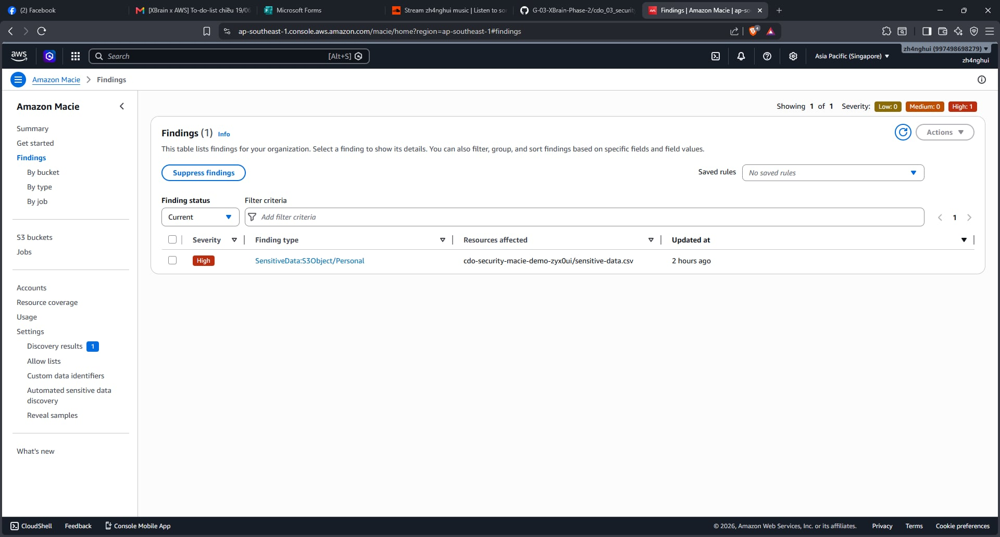
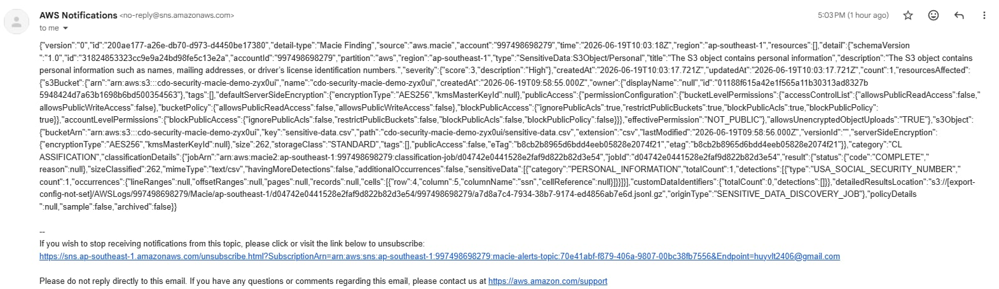

# Homework CDO Security: Detect Sensitive Data in S3 and Send Email Notifications

* **Họ và tên**: Võ Lê Trường Huy
* **Mã học viên**: XB-DN26-102
* **Bài tập ngày**: 19/06
* **Chủ đề**: Detect sensitive data in Amazon S3 buckets and send notifications using Amazon Macie

---

## 🏗️ Kiến trúc giải pháp (Architecture Diagram)

```
[User] ──(Uploads Sensitive File)──> [S3 Bucket]
                                        │
                               (Macie Scan Job)
                                        ▼
                                 [Amazon Macie]
                                        │
                               (Generates Findings)
                                        ▼
                              [Amazon EventBridge]
                                        │
                             (Triggers SNS Target)
                                        ▼
                                [Amazon SNS Topic] ──(Email Alert)──> [User Inbox]
```

---

## 📸 Hình ảnh minh chứng (Evidence of Completion)

### 1. Kết quả phát hiện dữ liệu nhạy cảm trong Amazon Macie Console
Dưới đây là hình ảnh kết quả quét tệp `sensitive-data.csv` trên Amazon Macie, phát hiện thông tin nhạy cảm định dạng cá nhân (Personal Data - Credit Card / SSN) với mức độ nghiêm trọng **High**.



### 2. Email cảnh báo nhận được từ Amazon SNS
Hình ảnh hộp thư email nhận được thông báo định dạng JSON chứa chi tiết Finding từ Amazon Macie thông qua luồng EventBridge -> SNS Topic.



---

## ⚙️ Chi tiết triển khai hệ thống (Infrastructure Details)

Hệ thống được triển khai tự động hóa hoàn toàn bằng **Terraform IaC** (nằm trong thư mục `terraform`):
* **S3 Bucket**: `cdo-security-macie-demo-zyx0ui` (lưu trữ tệp dữ liệu mẫu `sensitive-data.csv`).
* **Amazon Macie**: Được kích hoạt tự động và cấu hình chạy Classification Job `cdo-macie-scan-job` dạng một lần (`ONE_TIME`).
* **Amazon SNS Topic**: `macie-alerts-topic` (đã đăng ký email nhận tin `huyvtl2406@gmail.com`).
* **Amazon EventBridge Rule**: `macie-findings-rule` (bắt sự kiện `aws.macie` và chuyển tiếp đến SNS Topic).
